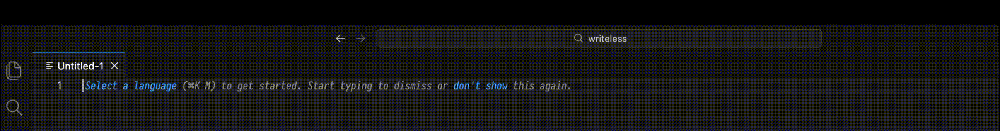

# Write Less

Voice-to-text macOS menubar app powered by OpenAI Whisper. Record speech with a global hotkey and get instant
transcription copied straight to your clipboard - all processed locally on your machine.

## Demo



## Install via Homebrew

```bash
brew tap romus/writeless
brew install --cask writeless
```

## Requirements (building from source)

- macOS 26+
- Python 3.14+

## Run from source

```bash
make run
```

This creates a virtual environment, installs dependencies, and launches the app.

## Build from source

```bash
make build       # Build Write Less.app
make dmg         # Build .app + DMG installer
make zip         # Build .app + ZIP archive
make help        # Show all available commands
```

The built app is located at `build/dist/Write Less.app`.

## Usage

- The app lives in the menubar (no Dock icon)
- **Cmd+Option+F8** (default) — start/stop recording; configurable in Settings
- If recording stalls with no incoming audio, it auto-stops after 10–25 seconds
- After recording stops, Whisper transcribes the audio and copies the result to the clipboard
- The Whisper model (~461 MB) is downloaded automatically on first use
- Menubar icon indicates state: 🎤 idle, 🎙️ recording, ⚙️ processing, ⬇️ downloading model

## Settings

Open **Settings…** from the menubar menu to configure:

- **Keyboard shortcut** — click the field and press any key combination to change the global hotkey
- **Notifications** — toggle system notifications for transcription results
- **SSL Verification** — toggle TLS certificate checks for model download (disable for problematic networks/proxies)

Settings are saved to `~/Library/Application Support/dev.romus.app.writeless/settings.json`.

## Permissions

macOS will prompt for:

- **Microphone** - required for audio recording
- **Accessibility** - required for the global hotkey
- **Input Monitoring** - required for reliable global hotkey capture
- **Notifications** - optional, for transcription result alerts

Permission status is shown in the menubar menu. Items for missing permissions appear automatically and link directly to the relevant System Settings pane. Once a permission is granted the corresponding menu item is hidden.

**If the app reports permissions missing even though System Settings shows them as granted**, macOS may be showing stale TCC database entries from a previously deleted version of the app. Fix by resetting permissions for the new app:

```bash
tccutil reset Accessibility dev.romus.app.writeless
tccutil reset ListenEvent dev.romus.app.writeless
tccutil reset Notifications dev.romus.app.writeless
```

Then restart the app — it will prompt for permissions again. Alternatively, go to System Settings → Privacy & Security → Accessibility / Input Monitoring / Notifications, remove "Write Less", and re-add it.

## Diagnostics

**Diagnostics** in the menubar menu shows audio device info, SSL status, and whether the Whisper model is loaded.
